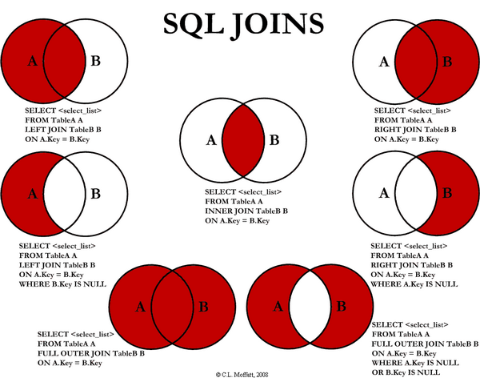

## What's the difference between an inner join and an outer join

I was asked this in an interview recently and I bombed, so I'm going to make sure I understand this so I can give a better answer next time I get asked this question.

### TL;DR
- Inner joins make a new table with the values of the joined tables where they have corresponding values.
- Outer joins can be used to get data for a new table, regardless of overlap.




### What is a join?
[From Wikipedia](https://en.wikipedia.org/wiki/Join_(SQL)):The `JOIN` clause used in SQL combines columns from one or more tables in a relational database. It creates a set that can be saved as a table or used as it is. A `JOIN` is a means for combining columns from one or more tables by using values common to each. Regular SQL has five types: `INNER`, `LEFT OUTER`, `RIGHT OUTER`, `FULL OUTER` and `CROSS`.

### Example scenario
Let's say you have a (very tiny) database of films. You want users to be able to get a list of all films in your database by director. You do this by selecting data from two tables named 'directors' and 'films'. The films table has a `director_id` column (a foreign key) that relates to the primary key (`director_id`) of the directors table.

Table: directors

| director_id    | first_name     | last_name      |
| :------------- | :------------- | :------------- |
| dir0001        | Woody          | Allen          |
| dir0002        | Jane           | Campion        |
| dir0003        | Ang            | Lee            |
| dir0004        | Steve          | Martin         |

Table: films

| film_id        | name                     | minutes     | director_id |
| :------------- | :----------------------  | :---------- | :---------- |
| film0001       | Jurassic Park            | 127         | null        |
| film0002       | The Piano                | 121         | dir0002     |
| film0003       | Manhattan Murder Mystery | 109         | dir0001     |
| film0004       | The Wedding Banquet      | 106         | dir0003     |
| film0005       | Groundhog Day            | 101         | null        |

To join the table 'directors' to the table 'films':  
- SELECT clause: specify the columns in both tables from which you want to select data (SQL allows you to use * to select all columns)
- FROM clause: specify the main table  
- [INNER | FULL OUTER | OUTER LEFT | OUTER RIGHT] JOIN clause: specify the table that the main table joins
- ON keyword used to connect the tables (ie primary key and foreign key)
- WHERE any condition for joining (eg some value IS null)

#### Inner join
You use an inner join to connect table data only where there is a corresponding key or other joining characteristic.

The INNER JOIN clause returns rows from the directors table that have corresponding rows in the films table (ie that have the director_id as a foreign key).

``` sql
SELECT * FROM directors
INNER JOIN films ON directors.director_id = films.director_id;  
```

Result:

| director_id    | first_name     | last_name      |
| :------------- | :------------- | :------------- |
| dir0001        | Woody          | Allen          |
| dir0002        | Jane           | Campion        |
| dir0003        | Ang            | Lee            |


#### Left join
The LEFT JOIN clause returns the rows in the directors table that may or may not have corresponding rows in the films table.

``` sql
SELECT * FROM directors  
LEFT [OUTER] JOIN films ON directors.director_id = films.director_id;  
```

Result:

| director_id    | first_name     | last_name      | film_id        | name                     | minutes     |
| :------------- | :------------- | :------------- | :------------- | :----------------------  | :---------- |
| dir0001        | Woody          | Allen          | film0003       | Manhattan Murder Mystery | 109         |
| dir0002        | Jane           | Campion        | film0002       | The Piano                | 121         |
| dir0003        | Ang            | Lee            | film0004       | The Wedding Banquet      | 106         |
| dir0004        | Steve          | Martin         | (null)         | (null)                   | (null)      |


#### Right join
A RIGHT JOIN (or right outer join) resembles a left join, except with the treatment of the tables reversed. Every row from the films table will appear in the joined table at least once. If there isn't a matching row from the directors table, null will appear in columns from directors for those rows that have no match in films.

``` sql
SELECT * FROM directors  
RIGHT [OUTER] JOIN films ON directors.director_id = films.director_id;  
```

Result:

| director_id    | first_name     | last_name      | film_id        | name                     | minutes     |
| :------------- | :------------- | :------------- | :------------- | :----------------------  | :---------- |
| dir0001        | Woody          | Allen          | film0003       | Manhattan Murder Mystery | 109         |
| dir0002        | Jane           | Campion        | film0002       | The Piano                | 121         |
| dir0003        | Ang            | Lee            | film0004       | The Wedding Banquet      | 106         |
| (null)         | (null)         | (null)         | film0001       | Jurassic Park            | 127         |
| (null)         | (null)         | (null)         | film0005       | Groundhog Day            | 101         |


#### Full outer join
Full outer join creates a new table with all records from the two tables, with matching records from both sides where available. If there is no match, the missing side will contain null.

``` sql
SELECT * FROM directors    
FULL [OUTER] JOIN films ON directors.director_id = films.director_id;  
```

Result:

| director_id    | first_name     | last_name      | film_id        | name                     | minutes     |
| :------------- | :------------- | :------------- | :------------- | :----------------------  | :---------- |
| dir0001        | Woody          | Allen          | film0003       | Manhattan Murder Mystery | 109         |
| dir0002        | Jane           | Campion        | film0002       | The Piano                | 121         |
| dir0003        | Ang            | Lee            | film0004       | The Wedding Banquet      | 106         |
| dir0004        | Steve          | Martin         | (null)         | (null)                   | (null)      |
| (null)         | (null)         | (null)         | film0001       | Jurassic Park            | 127         |
| (null)         | (null)         | (null)         | film0005       | Groundhog Day            | 101         |


#### Cross join
This is the third rail of joins - beware! It gets you a [cartesian product](https://en.wikipedia.org/wiki/Cartesian_product) of the two tables you've selected, which means every row connected without fear or favour to every row in the other table at least once. So it gets big and unweildy quickly. There's an interesting [Stackoverflow post](https://stackoverflow.com/questions/219716/what-are-the-uses-for-cross-join) about it.

#### Other types of joins

To return all films with no corresponding director:

``` sql
SELECT * FROM directors  
LEFT JOIN films ON directors.director_id = films.director_id
WHERE films.director_id IS null;
```

Result:

| director_id    | first_name     | last_name      | film_id        | name                     | minutes     |
| :------------- | :------------- | :------------- | :------------- | :----------------------  | :---------- |
| (null)         | (null)         | (null)         | film0001       | Jurassic Park            | 127         |
| (null)         | (null)         | (null)         | film0005       | Groundhog Day            | 101         |


To return all directors with no corresponding films:

``` sql
SELECT * FROM directors  
FULL JOIN films ON directors.director_id = films.director_id
WHERE film_id IS null
```

Result:

| director_id    | first_name     | last_name      | film_id        | name                     | minutes     |
| :------------- | :------------- | :------------- | :------------- | :----------------------  | :---------- |
| dir0004        | Steve          | Martin         | (null)         | (null)                   | (null)      |


### Table joining resources:  
- [A Visual Explanation of SQL Joins](https://blog.codinghorror.com/a-visual-explanation-of-sql-joins/)
- [PostgreSQL Tutorial](http://www.postgresqltutorial.com/), section 4
- [stackoverflow](http://stackoverflow.com/questions/38549/what-is-the-difference-between-inner-join-and-outer-join)
